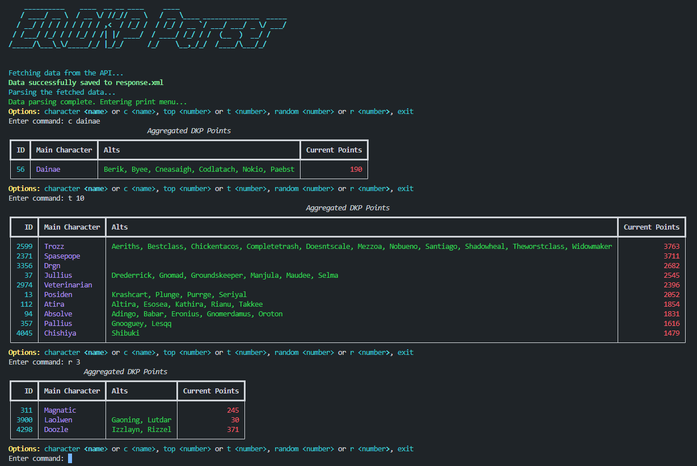

# EQDKP Parser Project

This project is a DKP (Dragon Kill Points) parser that processes XML files containing player and point information for an online game. It aggregates and associates characters based on their main and alt designations, fetching data from an API, and outputs this information in a clean and structured way using an interactive CLI.

## Features

- **Main and Alt Character Processing**: Identifies and separates main characters from their alts, ensuring alts are only processed after all mains have been identified.
- **Data Aggregation**: Collects point information including current, earned, spent, and adjusted points for each main character.
- **Fetch Data from API**: Securely fetches data from a remote API using an API key stored in an environment file.
- **Interactive Command Line Interface**: Provides an interactive CLI for viewing data.
- **Logging**: Logs all processing steps, including when main characters and alts are associated, and captures user commands and errors.
- **ASCII Art**: Launches with a cool ASCII header using the `pyfiglet` library for an engaging user experience.

## Data Model

The output data model is as follows:
- **id**: Main character's ID (integer).
- **main_character**: Main character's name (string).
- **alts**: List of tuples containing (ID, name) for each alt associated with the main character.
- **points**: A dictionary containing the following point values:
  - **earned**: Total points earned.
  - **spent**: Total points spent.
  - **adjusted**: Total points adjusted.
  - **current**: Current points.

## Installation

1. **Clone the repository**:
   ```bash
   git clone <repository-url>
   ```

2. **Set up a virtual environment**:
   ```bash
   python -m venv venv
   ```

3. **Activate the virtual environment**:
   ```bash
   # On Windows:
   .\venv\Scripts\activate

   # On macOS/Linux:
   source venv/bin/activate
   ```

4. **Install dependencies**:
   ```bash
   pip install -r requirements.txt
   ```

5. **Create a `.env` file**:
   If missing, the script will create a `.env` file and prompt you to set up your API key during runtime. The `.env` file should look like this:
   ```
   API_KEY_CORE_READ=your_api_key_here
   ```

## Usage

1. **Run the main script**:
   ```bash
   python main.py
   ```

2. **Follow the prompts** to set up your API key if required.

3. **Command Options**:
   After the data is fetched and parsed, you'll enter an interactive print menu. The following options are available:
   - **Character**:
     ```plaintext
     character <name> or c <name>
     ```
   - **Top N Characters**:
     ```plaintext
     top <number> or t <number>
     ```
   - **Random N Characters**:
     ```plaintext
     random <number> or r <number>
     ```
   - **Exit**:
     ```plaintext
     exit
     ```

## Logging

Logs are stored in a file named `main_script.log` in the project directory. The log captures all key steps and associations during processing, as well as user commands and errors.

## Example Output

Here’s an example of the console output:




## Project Structure

/project-directory
│
├── fetch_points.py          # Script for fetching points data from API
├── parse_dkp.py             # Script for parsing the fetched XML data
├── print_data.py            # Script for displaying parsed data in a formatted table
├── main.py                  # Main script that orchestrates the entire process
├── .env                     # Environment file for storing API key (not committed to repo)
├── requirements.txt         # Python dependencies
├── main_script.log          # Log file capturing all processing steps
└── README.md                # Project documentation


## Requirements

- **Python 3.x**
- **pandas** library
- **prettytable** library
- **rich** library
- **requests** library
- **dotenv** library
- **pyfiglet** library


## Author

Created by Casey McCarthy.

## License

This project is open-source and available under the MIT License.
