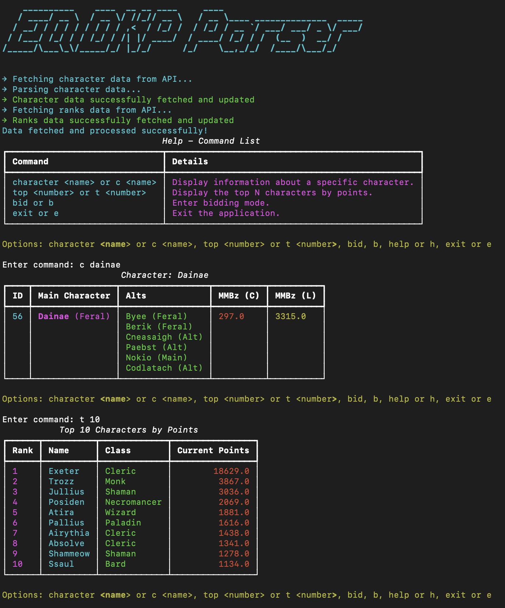
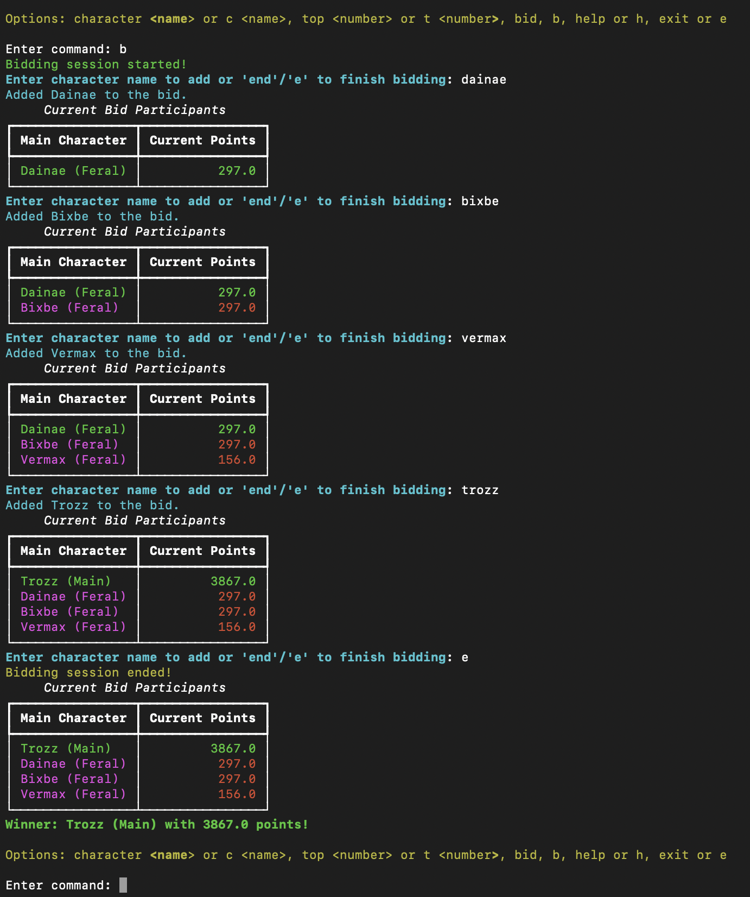

# EQDKP Parser Project

This project is a DKP (Dragon Kill Points) parser that exports point data from an EQDKP data via XML files. It then aggregates and associates characters based on their main and alt designations and outputs this information in a clean and structured way using an interactive CLI.

## Example Output

Here’s an example of the console output:




## Features

- **Interactive Command Line Interface**: Provides an interactive CLI for viewing data.
- **Fetch Data from API**: Securely fetches data from a remote API using an API key stored in an environment file.
- **Character Query**: Search for a character, their status, and their earned points.
- **Top N Characters**: View the top N characters by earned points.
- **Bidding Mode**: Allows users to enter a bidding mode to manage character bids interactively.

## Installation

Assuming you already have Python installed, follow these steps to set up the project:

1. **Clone the repository**:
   ```bash
   git clone https://github.com/casey-mccarthy/eqdkp-points-parser.git
   ```

2. **Set up a virtual environment**:
   ```bash
   python -m venv venv
   ```

3. **Activate the virtual environment**:
   ```bash
   # On Windows:
   .\venv\Scripts\activate

   # On macOS/Linux:
   source venv/bin/activate
   ```

4. **Install dependencies**:
   ```bash
   pip install -r requirements.txt
   ```

5. **Create a `.env` file**:
   If missing, the script will create a `.env` file and prompt you to set up your API key during runtime. The `.env` file should look like this:
   ```
   API_KEY=your_api_key_here
   ```
   This key can be located under your `Private API-Key` section of your profile on the EQDKP site.

## Usage

1. **Run the main script**:
   ```bash
   python run.py
   ```

2. **Follow the prompts** to set up your API key if required.

3. **Command Options**:
   After the data is fetched and parsed, you'll enter an interactive print menu. The following options are available:
   - **Character**:
     ```plaintext
     character <name> or c <name>
     ```
   - **Top N Characters**:
     ```plaintext
     top <number> or t <number>
     ```
   - **Enter Bidding Mode**:
     ```plaintext
     bid or b
     ```
   - **Exit**:
     ```plaintext
     exit or e
     ```

## Author

Created by Casey McCarthy.

## License

This project is open-source and available under the MIT License.
